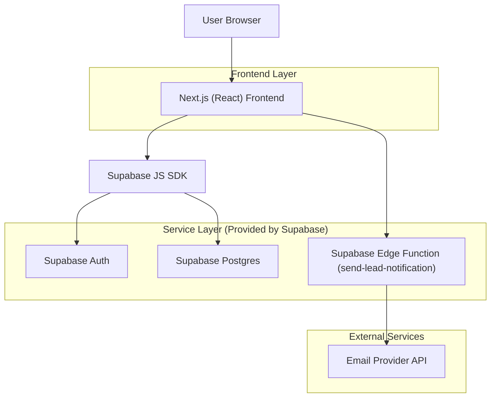
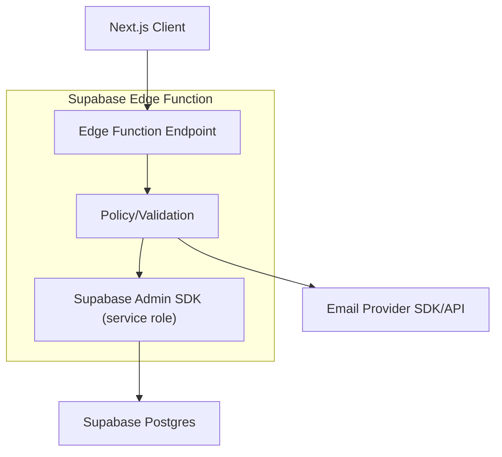
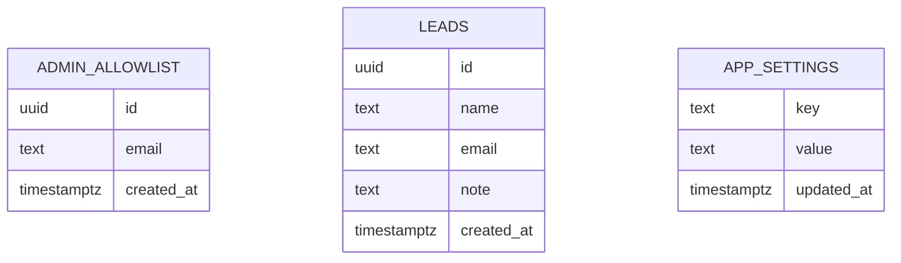

## 1.Architecture design


## 2.Technology Description
- Frontend: Next.js@16 + React@19 + TypeScript@5 + Tailwind CSS@4
- Backend: Supabase (Auth + Postgres + Edge Functions)
- Email: Resend (or equivalent) called from Supabase Edge Function (API key stored as secret)

## 3.Route definitions
| Route | Purpose |
|-------|---------|
| / | Landing page with lead capture form |
| /admin | Admin-only dashboard (shows sign-in when logged out) |

## 4.API definitions (If it includes backend services)
### 4.1 Edge Functions
Send lead notification email
```
POST /functions/v1/send-lead-notification
```
Request (JSON):
| Param Name| Param Type | isRequired | Description |
|---|---|---|---|
| lead_id | string (uuid) | true | Lead row ID used to fetch lead data server-side |

Response (JSON):
| Param Name| Param Type | Description |
|---|---|---|
| ok | boolean | Whether email was queued/sent |

Shared TypeScript types
```ts
export type Lead = {
  id: string;
  name: string | null;
  email: string;
  note: string | null;
  created_at: string;
};

export type AppSetting = {
  key: string; // e.g. "admin_notification_email"
  value: string;
  updated_at: string;
};
```

## 5.Server architecture diagram (If it includes backend services)


## 6.Data model(if applicable)

### 6.1 Data model definition
- leads: stores landing page submissions
- admin_allowlist: list of emails permitted to access `/admin`
- app_settings: key/value app config (stores admin notification email)



### 6.2 Data Definition Language
Leads Table (leads)
```sql
CREATE TABLE IF NOT EXISTS leads (
  id UUID PRIMARY KEY DEFAULT gen_random_uuid(),
  name TEXT,
  email TEXT NOT NULL,
  note TEXT,
  created_at TIMESTAMPTZ NOT NULL DEFAULT now()
);

ALTER TABLE leads ENABLE ROW LEVEL SECURITY;

-- Allow public lead submission (insert-only) for MVP
CREATE POLICY "anon_insert_leads" ON leads
FOR INSERT TO anon
WITH CHECK (true);

-- Allow admins to read all leads
CREATE POLICY "admin_read_leads" ON leads
FOR SELECT TO authenticated
USING (
  EXISTS (
    SELECT 1 FROM admin_allowlist a
    WHERE lower(a.email) = lower(auth.jwt() ->> 'email')
  )
);

GRANT SELECT ON leads TO anon;
GRANT ALL PRIVILEGES ON leads TO authenticated;
```

Admin Allowlist (admin_allowlist)
```sql
CREATE TABLE IF NOT EXISTS admin_allowlist (
  id UUID PRIMARY KEY DEFAULT gen_random_uuid(),
  email TEXT UNIQUE NOT NULL,
  created_at TIMESTAMPTZ NOT NULL DEFAULT now()
);

ALTER TABLE admin_allowlist ENABLE ROW LEVEL SECURITY;

-- Only allow authenticated admins to read allowlist (optional, minimal)
CREATE POLICY "admin_read_allowlist" ON admin_allowlist
FOR SELECT TO authenticated
USING (
  EXISTS (
    SELECT 1 FROM admin_allowlist a
    WHERE lower(a.email) = lower(auth.jwt() ->> 'email')
  )
);

GRANT SELECT ON admin_allowlist TO anon;
GRANT ALL PRIVILEGES ON admin_allowlist TO authenticated;
```

Settings (app_settings)
```sql
CREATE TABLE IF NOT EXISTS app_settings (
  key TEXT PRIMARY KEY,
  value TEXT NOT NULL,
  updated_at TIMESTAMPTZ NOT NULL DEFAULT now()
);

ALTER TABLE app_settings ENABLE ROW LEVEL SECURITY;

CREATE POLICY "admin_read_settings" ON app_settings
FOR SELECT TO authenticated
USING (
  EXISTS (
    SELECT 1 FROM admin_allowlist a
    WHERE lower(a.email) = lower(auth.jwt() ->> 'email')
  )
);

CREATE POLICY "admin_update_settings" ON app_settings
FOR UPDATE TO authenticated
USING (
  EXISTS (
    SELECT 1 FROM admin_allowlist a
    WHERE lower(a.email) = lower(auth.jwt() ->> 'email')
  )
)
WITH CHECK (true);

GRANT SELECT ON app_settings TO anon;
GRANT ALL PRIVILEGES ON app_settings TO authenticated;

-- seed configurable email
INSERT INTO app_settings(key, value)
VALUES ('admin_notification_email', 'admin@example.com')
ON CONFLICT (key) DO NOTHING;
```
